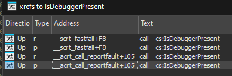
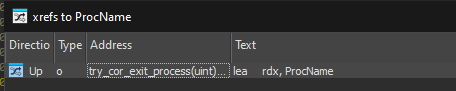

# Bypassing Combat Master’s Anti-Debug

*December 26, 2025*


Everything below is from the current live build (12/26/25).

### Direct Call to IsDebuggerPresent

Search the main executable (`CombatMaster.exe`) for the string “IsDebuggerPresent” 
(or just scan imports).  

You will find 4 xrefs to this string 

> 

Notice how there is ZERO to non vc++ functions. that is because they removed all direct calls to this in recent updates.

### The PEB

Combat Master does not call any functions to stop debugging but it deliberately finds the NtPeb condition that forces Windows to check if its debugged (not `IsBeingDebugged`).

(this is to prevent people from j
ust adding a breakpoint. and usually patching)

Since they did a terrible job finding methods to use they just check NTPeb which is only set by the two functions that are patched below.


### How to find the function that checks for debuggerse.
Search for "CorExitProcess". You will find exactly one xref to this. 
> 

Then find all xrefs to the function that it led you to. (it should be named `try_cor_exit_process`).

There should be a few xrefs but you need the one called `exit_or_terminate_process` the function is defined as `void __fastcall __noreturn exit_or_terminate_process(UINT a1)`

Inside of the function there is an if statement checking the return value of a function. this function is the function we are looking for. `should_call_terminate_process`

The functions disssassembly is actually quite simple it checks for `(NtCurrentPeb()->NtGlobalFlag & 0x100)` and `acrt_get_process_end_policy() != 1.`

> The dissassembly is shown below

```asm
.text:0000000140005CA8                 sub     rsp, 28h
.text:0000000140005CAC                 call    __acrt_get_process_end_policy
.text:0000000140005CB1                 cmp     eax, 1
.text:0000000140005CB4                 jz      short loc_140005CD1
.text:0000000140005CB6                 mov     rcx, gs:60h     ; PEB
.text:0000000140005CBF                 mov     edx, [rcx+0BCh] ; NtGlobalFlag
.text:0000000140005CC5                 shr     edx, 8          ; shift 8 bits
.text:0000000140005CC8                 test    dl, 1           ; check if bit 0x100 is true
.text:0000000140005CCB                 jnz     short loc_140005CD1 ; if set, jump to code that returns false (do not call terminate)
.text:0000000140005CCD                 mov     al, 1
.text:0000000140005CCF                 jmp     short loc_140005CD3
```

<!-- When `DebugActiveProcess` is called on an already-running process that is not being debugged, Windows internally creates a remote thread that executes `DbgUiRemoteBreakin` inside the target process.  
If that function is patched to `ret`, this whole trick becomes harmless. -->


### My Patch In Action (Live Screenshots From Today)

Here is the before/after from the current version (Dec 2025):

**Before patching** – first bytes of `IsDebuggerPresent` in kernel32.dll  
`4C 8B D1              mov r10, rcx`  
`B8 3A 00 00 00        mov eax, 3Ah`

**After debubg → instant crash**

**After single-byte patch to 0xC3**  
`C3                    ret`

Same story with `DbgUiRemoteBreakin` inside ntdll.dll:

**Original prologue**  
`4C 8B D1              mov r10, rcx`  
`B8 5F 00 00 00        mov eax, 5Fh`

**Patched to**  
`C3                    ret`
#### Proof


```cpp
[*] DbgUiRemoteBreakin @ 0x00007FF843A1C9C0
[BEFORE] ret patch: B8 5F 00 00 00
[AFTER] ret patch: C3 4A 36 15 00
[+] Patched DbgUiRemoteBreakin with RET
```

```cpp
bool patch_dbgbreak() {
// patching lib is closed src
    void* dbgbreak = patcher::get_proc("ntdll.dll", "DbgUiRemoteBreakin");
    if (!dbgbreak) {
        return false;
    }

    printf("[*] DbgUiRemoteBreakin @ 0x%p\n", dbgbreak);

    g_patch.set(dbgbreak);
    if (g_patch.apply_ret()) {
        printf("[+] Patched DbgUiRemoteBreakin with RET\n");
        return true;
    }

    printf("[!] Failed to patch DbgUiRemoteBreakin\n");
    return false;
}
```

Meaning a single `0xC3` byte is literally enough to play the game with the debugger attached.


### merry christmas 🎄 
hope this post helps you in some way shape or form.
